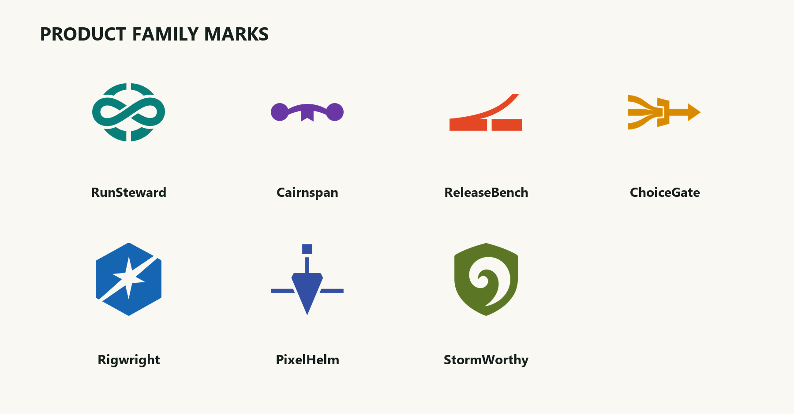
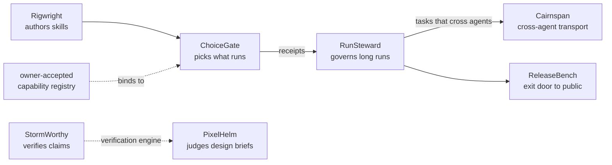

# Proofward

**AI you can leave alone: every decision it makes is provable, and every irreversible step waits for your yes.**

Proofward is a family of seven tools built on two habits. First, every tool answers with something you can check: a receipt of what it did, a checkpoint you can resume from, or a typed claim tied to a source. Second, every tool would rather refuse with a named reason than guess, and anything irreversible (installing software, spending money, publishing) stops and waits for a human yes.

## The seven families

| | Family | What it does |
|:-:|:--|:--|
|  | [**ChoiceGate**](https://gitlab.com/krahul02004/ChoiceGate)  | When an agent is about to do a task, ChoiceGate picks the single best capability for it: a skill, a local tool, an MCP server, or an integration. It looks beyond what is already installed; if something materially better exists, it surfaces that as an owner-approved choice, with browser or manual work as the explicit last resort. Deterministic receipts, refusal with a named reason, and it never installs or runs anything itself. |
|  | [**RunSteward**](https://gitlab.com/krahul02004/RunSteward)  | Lets a developer hand an agent work too big for one sitting and walk away: queued tasks with a spending cap, checkpoints, resume after usage-limit resets, and a reviewable morning report. Bundles Claude Carry, the overnight runner. |
|  | [**Cairnspan**](https://gitlab.com/krahul02004/Cairnspan)  | Lets one local coding agent hand a bounded task to another (Claude Code and Codex, each through its own logged-in client, no shared keys), with fail-closed launchers and a receipt for every run. |
|  | [**StormWorthy**](https://gitlab.com/krahul02004/StormWorthy)  | A research engine that argues with itself before it answers: an adversarial refuter, typed claims verified against cited sources, and honest abstention when the evidence is thin. |
|  | [**Rigwright**](https://gitlab.com/krahul02004/Rigwright)  | A workshop for authoring and testing the small skill files agents run on: one measurable outcome per skill, its own eval set, and generated packaging for both Claude Code and Codex. |
|  | [**PixelHelm**](https://gitlab.com/krahul02004/PixelHelm)  | Makes an agent design UI the way a team does: generate candidates, render them in a real browser, judge them against accessibility gates and an honesty floor (missing data shows as unknown, never as a fake zero), repair, repeat. |
|  | [**ReleaseBench**](https://gitlab.com/krahul02004/ReleaseBench)  | Walks a repo from private to public without a public mistake: health audit, secret scan, governance files, README polish, and release prep, with each step stopping at a reviewable result. |

## How the pieces fit

This is the canonical topology used at both Proofward entry points.

[Rigwright](https://gitlab.com/krahul02004/Rigwright) authors the small skill files agents run on. [ChoiceGate](https://gitlab.com/krahul02004/ChoiceGate) picks which capability runs for a given task; it binds to an owner-accepted capability registry rather than managing capabilities itself. [RunSteward](https://gitlab.com/krahul02004/RunSteward) governs long unattended runs and ingests ChoiceGate's receipts. [Cairnspan](https://gitlab.com/krahul02004/Cairnspan) is the transport when a bounded task has to cross from one agent to another. [StormWorthy](https://gitlab.com/krahul02004/StormWorthy) verifies claims against cited sources, and [PixelHelm](https://gitlab.com/krahul02004/PixelHelm) vendors its engine to judge design briefs. [ReleaseBench](https://gitlab.com/krahul02004/ReleaseBench) is the exit door: the checked path from private work to a public repo.

## Start here

Start with [StormWorthy](https://gitlab.com/krahul02004/StormWorthy) and [Cairnspan](https://gitlab.com/krahul02004/Cairnspan): one shows the proof discipline, the other shows the handoff discipline.

## License

MIT. See [LICENSE](LICENSE).
